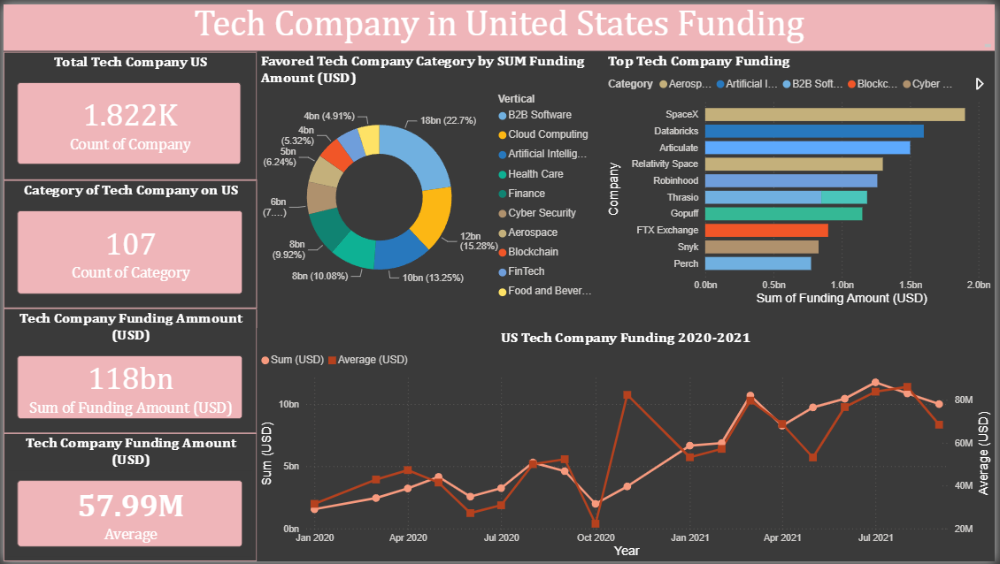

# Tech Company in United States Funding Dashboard

## Project Overview
This project presents an interactive dashboard to analyze funding data of tech companies in the United States. The project focuses on identifying funding distribution by company category, top-funded companies, total funding performance, and monthly funding trends from 2020 to 2021.

## Tools
- Python
- Power BI
- Pandas
- Microsoft Excel / CSV

## Problem
The raw tech company funding dataset needed to be cleaned, structured, and visualized to make the funding information easier to understand. Without proper data preparation and visualization, it was difficult to identify which company categories received the most funding, which companies had the highest funding, and how funding trends changed over time.

## Action
Cleaned and prepared the dataset using Python by checking data quality, handling inconsistent formats, and structuring the data for further analysis. After the data was ready, an interactive Power BI dashboard was built using KPI cards, donut chart, bar chart, and trend line chart to visualize company count, category distribution, funding amount, top company funding, and monthly funding trends.

## Result
The dashboard analyzed 1.822K tech companies across 107 categories, with a total funding amount of $118B and an average funding of $57.99M. The analysis showed that B2B Software was the highest-funded category, contributing around $18B or 22.7% of total funding. SpaceX was identified as the highest-funded company, followed by Databricks and Articulate. The dashboard also showed an increasing funding trend from 2020 to 2021, indicating stronger funding activity in the US tech industry during 2021.

## Dashboard Preview

## Files
- `tech-company-funding-dashboard.pbix` — Power BI dashboard file
- `tech-company-funding-dataset.csv` — cleaned dataset
- `dashboard-preview.png` — dashboard preview image
- `README.md` — project documentation

## Key Insights
- The dataset contains 1.822K tech companies from 107 categories.
- Total funding reached $118B, with an average funding of $57.99M.
- B2B Software became the most funded category with around $18B or 22.7% of total funding.
- SpaceX recorded the highest funding amount among all companies.
- Funding activity showed an overall increase from 2020 to 2021.

## Project Purpose
This project was created to practice data cleaning using Python and data visualization using Power BI. It demonstrates how raw funding data can be transformed into a structured dashboard to support clearer analysis and insight generation.
